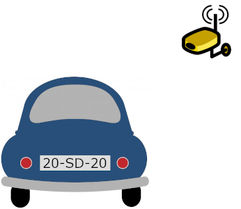
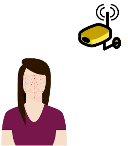
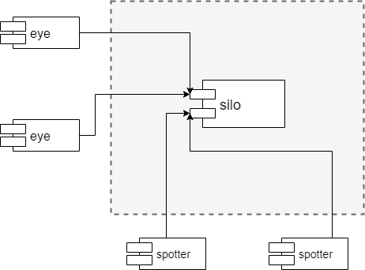

Sauron: primeira parte
======================

O objetivo do projeto de Sistemas Distribuídos (SD) é desenvolver o sistema **Sauron** que ajuda a encontrar pessoas e objetos perdidos.
O sistema será implementado através de um conjunto de serviços gRPC implementados na plataforma Java.

O projeto está estruturado em duas partes.
Este documento apresenta a primeira parte do projeto, onde se descreve o contexto, os principais componentes da arquitetura e os requisitos a satisfazer.

1 Introdução
------------

As câmeras de vídeovigilância são dispositivos cada vez mais presentes no nosso dia-a-dia. 
<!-- para "câmara" vs "câmera" ver https://ciberduvidas.iscte-iul.pt/consultorio/perguntas/camaracamera/15129 -->
Tradicionalmente, a sua função é registar imagens que podem depois ser consultadas por autoridades, em caso de necessidade.
Por exemplo, as imagens registadas podem ajudar a investigar um crime.

Graças aos avanços no reconhecimento de imagens, tornou-se possível ter câmeras inteligentes que conseguem "ver" e "reconhecer". 
Por exemplo, é possível reconhecer veículos a partir da sua matrícula.

E é também possível reconhecer pessoas através da sua cara.

Embora o uso destas tecnologias levante algumas questões importantes, nomeadamente relacionadas com privacidade, o facto é que têm um grande potencial de utilização.

2 Arquitetura do sistema
------------------------

O sistema Sauron assume que existem diversas câmeras, espalhadas por diferentes localizações.
Cada câmera -- *eye* -- captura imagens, faz o seu processamento e reporta o que vê para um serviço de armazenamento.
Um *silo* armazena observações, podendo mais tarde responder a pedidos de interrogação, feitos por clientes chamados *spotters*.

A figura seguinte mostra uma visão global dos componentes da solução.

Na primeira parte vai construir-se uma primeira versão de todos os componentes: *silo*, *eye*, e *spotter*. 
A seguir especificam-se detalhes sobre cada componente.

2.1 Servidor *silo*
-------------------

O servidor *silo* regista câmeras, recebe e armazena observações e depois responde a pesquisas.

As operações a disponibilizar por um servidor *silo* são as seguintes:

-   `cam_join` -- regista uma câmera.  
Recebe um nome de uma nova câmera e as suas coordenadas de localização.  
O nome indicado tem que ser único i.e. não pode ser duplicado de um já existente;

-   `cam_info` -- recebe o nome de uma câmera e devolve as suas coordenadas de localização;

-   `report` -- recebe observações.  
Recebe o nome da câmera, um conjunto de observações, e os dados correspondentes.  
O nome deve corresponder a uma câmera registada previamente.  
O servidor regista as observações com a sua data e hora, no momento da receção;

-   `track` -- permite localizar um objeto observado.  
Recebe o tipo de objeto a localizar e o identificador do objeto procurado.  
Devolve a observação mais recente do objeto procurado;

-   `trackMatch` -- permite localizar um objeto observado com parte do seu identificador.  
Recebe o tipo de objeto a localizar e parte do identificador do objeto procurado.  
Devolve a observação mais recente para cada objeto encontrado, sem nenhuma ordenação específica;

-   `trace` -- permite obter o rasto de um objeto observado.  
Recebe o tipo de objeto e o identificador exato do objeto.  
Devolve uma lista de observações do objeto, ordenada da observação mais recente para a mais antiga.

Os resultados das operações de pesquisa devem ser devolvidas em mensagens estruturadas, com campos individuais para cada atributo.  
Os campos devem ser descritos com o tipo de dados mais adequado ao seu conteúdo, de modo a permitir o melhor mapeamento possível para os tipos da linguagem de programação.

### Argumentos

O nome de uma câmera deve ser alfanumérico com comprimento mínimo de 3 e máximo de 15 caracteres.  
O nome deve ser descritivo do local onde a câmara se encontra instalada.

As coordenadas de uma câmera devem indicar a latitude e a longitude do local onde está instalada.

Uma observação tem um tipo, um identificador e uma data e hora, com precisão de segundos.

Os tipos de objeto detetados pelo sistema são: `person` e `car`; mas deve ser possível adicionar novos tipos no futuro.

O identificador de uma pessoa é um número inteiro positivo com pelo menos 63 bits.  
Trata-se de um pseudo-identificador, ou seja, um número único que não tem relação com o cartão de cidadão ou número de contribuinte ou outro que permita saber quem é a pessoa.

Para especificar uma parte do identificador de uma pessoa pode ser utilizado o carácter especial `*` (asterisco).  
Por exemplo, `*7` representa qualquer número terminado em 7, como 137, o 87 e o próprio 7;  
`22*` representa qualquer número começado por 22, como 221 e 22;  
`22*7` representa qualquer número começado por 22 e terminado em 7, como 2207 ou 227.

O identificador de um carro é uma matrícula com o formato português, ou seja, é texto estruturado em três grupos de dois caracteres.
Para cada grupo, os caracteres podem ser letras do alfabeto (maiúsculas) ou dígitos decimais.
Um grupo ou é de letras ou é de dígitos.
O identificador no máximo contém dois grupos do mesmo tipo.

Para as matrículas também se pode usar o carácter especial `*`.  
Por exemplo, `*AA` representa qualquer matrícula terminada por AA, como AA00AA;  
`B*` representa qualquer matrícula começada por B, como BA1080;  
`701*L` representa qualquer matrícula começada por 701 e terminada em L, como 7019XL.

### Operações de controlo

Cada servidor deve dispor também de um conjunto de operações de controlo. 
Estas operações destinam-se a facilitar a realização de testes.
Estas funções não necessitam elas próprias de ser testadas exaustivamente.  
Por convenção, o nome das operações de controlo deve começar por `ctrl_`.

-   `ctrl_ping` -- recebe um pedido de sinal de vida e responde com uma mensagem indicando o estado do servidor;

-   `ctrl_clear` -- deve limpar totalmente o estado do servidor;

-   `ctrl_init...` -- permitem definir parâmetros de configuração inicial do servidor.

### Biblioteca cliente

Juntamente com o servidor *silo* deve ser desenvolvida a biblioteca *silo-client*.
Este biblioteca deve conter o objeto `SiloFrontend` que permite fazer chamadas remotas ao servidor.
A biblioteca deve ser usada pelos clientes *eye* e *spotter* a desenvolver.

Futuramente, este objeto irá encapsular a utilização de servidores de nomes e protocolos de replicação.

### Testes de integração

A biblioteca `silo-client` deve conter também *testes de integração* (IT -- *Integration Tests*) que permitam verificar o funcionamento correto das operações do servidor.  
Quando os testes de integração se iniciam, assume-se que o servidor remoto a contactar já foi previamente lançado de forma correta.
Os IT verificam o cumprimento do contrato de um serviço através de invocações remotas.  

2.2 Cliente *eye*
-----------------

Um *eye* captura imagens de vídeo, faz o seu processamento e depois envia um conjunto de observações acumuladas para o servidor de armazenamento. 
Cada câmera tem associado um nome e uma localização em coordenadas: latitude, longitude.  
Por exemplo, uma câmera à porta do Pavilhão Central do IST tem as coordenadas 38.736748, -9.138908; 
uma câmera no IST Taguspark tem as coordenadas 38.737613, -9.303164.

O *eye* tem uma interface-utilizador de linha de comando. 
O programa deve ler do *standard input* linhas de texto, sendo que cada linha corresponde a uma observação.
As observações devem ser memorizadas à medida que são lidas. 
Ao receber uma linha vazia, ou ao detetar o fecho do *standard input*, o cliente deve enviar as observações entretanto acumuladas para o servidor.

### Argumentos

O *eye* deverá receber como argumentos na linha de comando, o servidor e o porto do *silo*, o nome da câmera e as coordenadas onde está localizada, em [notação decimal](https://en.wikipedia.org/wiki/Decimal_degrees).

Por exemplo, o *eye* pode ser lançado da seguinte forma:

    $ eye localhost 8080 Tagus 38.737613 -9.303164

O programa fica de seguida à espera de dados para enviar.

### Envio de informação

Os dados a enviar são organizados em linhas de texto.
Dentro de uma linha de texto, os campos são separados por `,` (vírgula).

**Exemplos:**

Submeter a observação de uma pessoa:

    person,5026726351

Submeter a observação de um veículo:

    car,20SD20

Submeter várias observações:

    car,20SD21
    person,108735282
    car,20SD22

Em todos os exemplos acima, o envio só é feito após uma linha vazia ou caso o *standard input* seja fechado.

### Redirecionamento de dados

É possível enviar o conteúdo de um ficheiro para o programa, com o operador de redirecionamento:

    $ eye localhost 8080 Tagus 38.737613 -9.303164 < data.txt

O conteúdo do ficheiro de texto é enviado para o programa.

### Linhas especiais

Existem também linhas especiais:  
linhas começadas por `#` (cardinal) devem ser ignoradas e podem ser usadas para criar comentários;  
linhas começadas por `zzz` seguido de um número inteiro devem causar uma pausa no processamento dos dados, durante tantos milisegundos quanto o número indicado na respetiva linha.

**Exemplo:**

    # lote 1
    person,5638246
    car,20SD23

    zzz,1000

    #lote 2
    car,20SD24

No exemplo acima, a primeira linha é ignorada e contém um comentário.  
Ao chegar à linha em branco, são enviadas as duas observações, de uma pessoa e de um carro.  
A linha seguinte faz com que exista uma pausa de 1 segundo no envio.  
A linha em branco a seguir não envia nada, porque não havia observações acumuladas.  
A linha a seguir é ignorada e contém também um comentário.  
A linha seguinte contém a observação de um carro.  
O *input* fecha a seguir e é feito o envio da observação.

2.3 Cliente *spotter*
---------------------

O *spotter* é uma interface-utilizador de linha de comando que permite lançar interrogações a um *silo*.  
Para um dado objeto, deve ser possível: obter a sua observação mais recente e obter o seu rasto de observações.
Cada objeto tem um tipo (`person`\\`car`) e um identificador.

### Argumentos

O *spotter* deverá receber como argumentos na linha de comando, o servidor e o porto do *silo* a contactar. 

Por exemplo, o *spotter* pode ser lançado da seguinte forma:

    $ spotter localhost 8080

### Pesquisa

Os comandos de pesquisa que permitem procurar objetos observados chamam-se *spot* e *trail*. 
Atente que estes comandos são parecidos com as operações do servidor *silo* mas têm algumas diferenças para tornar a experiência de utilização mais simples.

### Comando *spot*

O comando `spot` procura a observação do objeto ou pessoa com o identificador ou fragmento de identificador. 
O resultado devem ser linhas com o formato:

    Tipo,Identificador,Data-Hora,Nome-Câmera,Latitude-Câmera,Longitude-Câmera

O resultado deve ser ordenado por identificador crescente. 
A data-hora deve seguir o formato textual [ISO 8601](https://www.iso.org/iso-8601-date-and-time-format.html), com precisão de segundos. 

**Exemplos:**

Procura com o identificador exatamente igual ao indicado, e nada é devolvido (linha vazia):

    $ spot person 14388236
    

Procura com o identificador exatamente igual ao indicado, e é devolvido um resultado:

    $ spot car 7013LL
    car,7013LL,2019-10-04T10:02:07,Tagus,38.737613,-9.303164

Procura por identificadores que começam com o valor parcial indicado.
Neste caso, apenas foi encontrado um resultado:

    $ spot car 70*
    car,7013LL,2019-10-04T10:02:07,Tagus,38.737613,-9.303164

Procura por identificadores que terminam nos valores indicados. 
Foram encontrados dois resultados, que aparecem ordenados por identificador crescente:

    $ spot car *LL
    car,5759LL,2019-10-22T09:07:51,Tagus,38.737613,-9.303164
    car,7013LL,2019-10-04T11:02:07,Tagus,38.737613,-9.303164

### Comando *trail*

O comando `trail` procura o caminho percorrido pelo objeto ou pessoa, com o identificador exato, e com resultados ordenados da observação mais recente para a mais antiga. 
O resultado são linhas com o mesmo formato do comando *spot*.

**Exemplos:**

Procura o rasto do objeto com o identificador igual ao indicado, e nada é devolvido (linha vazia):

    $ trail person 14388236

Procura o rasto do objeto com o identificador igual ao indicado, e são devolvidos três resultados:

    $ trail car 7013LL
    car,7013LL,2019-10-04T10:02:07,Tagus,38.737613,-9.303164
    car,7013LL,2019-10-03T08:10:20,Alameda,38.736748,-9.138908
    car,7013LL,2019-10-02T22:33:01,Tagus,38.737613,-9.303164

### Comandos adicionais

Este cliente deve ter também comandos adicionais que permitam chamar as operações de controlo: *ping*, *clear*, e restantes.
A sintaxe destes comandos é livre, no entanto, é obrigatório ter o comando `help` que imprime informação sobre os comandos suportados e respetivos argumentos.

3 Tecnologia
------------

Todos os componentes do projeto têm de ser implementados na linguagem de programação [Java](https://docs.oracle.com/javase/specs/).  
A ferramenta de construção a usar, obrigatoriamente, é o [Maven](https://maven.apache.org/).  
A biblioteca de testes recomendada é o [JUnit](https://junit.org/), mas pode ser usada uma equivalente.  
O ambiente de desenvolvimento recomendado é o [Eclipse](https://www.eclipse.org/), mas pode ser usado um equivalente.  
**Nota importante:** caso optem por ferramentas alternativas às recomendadas, não será garantido o apoio técnico dos docentes. 

### Invocações remotas

A invocação remota de serviços deve ser suportada por serviços [gRPC](https://grpc.io/).  
Os serviços devem ser descritos no formato [*Protocol Buffers*](https://developers.google.com/protocol-buffers), abreviado por `protobuf`.
Cabe ao grupo definir os *protocol buffers* que julguem necessários para concretizar o projeto.

Não existem contratos de serviço pré-definidos.
Os contratos devem tirar partido do sistema de tipos disponível.  
Por exemplo, para devolver as datas deve ser usado o tipo `google.protobuf.Timestamp`, para valores monetários (se os houvesse) `google.type.Money`, etc.

O objeto Java a criar, `SiloFrontend`, deve encapsular o *stub* gerado pela biblioteca gRPC.
Deve expor métodos para cada operação com os mesmos tipos de dados gerados a partir dos *protocol buffers*.

<!--
O `SiloFrontend` deve ter construtores ou métodos-fábrica que recebem a localização do servidor a contactar e outras configurações que venham a ser necessárias.

Podem consultar mais informação sobre métodos-fábrica no livro [Bloch, Effective Java, Chapter 2](https://books.google.com/books?id=ka2VUBqHiWkC&pg=PA5).
-->

### Organização do código

Recomenda-se que o código do servidor *silo* contenha um pacote `domain` onde são representadas as entidades e comportamentos do domínio.
O código gRPC deve ser visto como uma camada de apresentação.

### Persistência

Não se exige nem será valorizado o armazenamento persistente do estado dos servidores. 

4 Resumo
--------

Em resumo, na primeira parte do trabalho, é necessário implementar:  
o servidor, *silo*;  
o cliente com testes automáticos, *silo-client*;  
o cliente para carregamento de dados, *eye*; e  
o cliente para interrogação, *spotter*.  
O *eye* e o *spotter* oferecem uma interface-utilizador baseada na linha de comandos.

5 Avaliação
===========

5.1 Fotos
---------

Cada membro da equipa tem que atualizar o Fénix com uma foto, com qualidade, tirada nos últimos 2 anos, para facilitar a identificação e comunicação.

5.2 Identificador de grupo
--------------------------

O identificador do grupo tem o formato `CXX`, onde: `C` representa o campus (A para Alameda e T para Taguspark) e `XX` representa o número do grupo de SD atribuído pelo Fénix.  
Por exemplo, o grupo A22 corresponde ao grupo 22 sediado no campus Alameda; já o grupo T07 corresponde ao grupo 7 sediado no Taguspark.

O grupo deve identificar-se no documento `README.md` na pasta raíz do projeto.

Em todos os ficheiros de configuração `pom.xml` e de código-fonte, devem substituir `CXX` pelo identificador de grupo.  
Esta alteração é importante para a gestão de dependências, para garantir que os programas de cada grupo utilizam sempre os módulos desenvolvidos pelo próprio grupo.

5.3 Colaboração
---------------

O [Git](https://git-scm.com/doc) é um sistema de controlo de versões do código fonte que é uma grande ajuda para o trabalho em equipa. 
Toda a partilha de código para trabalho deve ser feita através do [GitHub](https://github.com). 

O repositório de cada grupo está disponível em: https://github.com/tecnico-distsys/CXX-Sauron/ (substituir `CXX` pelo identificador de grupo).

A atualização do repositório deve ser feita com regularidade, correspondendo à distribuição de trabalho entre os membros da equipa e às várias etapas de desenvolvimento. 
Cada elemento do grupo deve atualizar o repositório do seu grupo à medida que vai concluindo as várias tarefas que lhe foram atribuídas.

Propõe-se a seguinte divisão de tarefas:

- bloco central - (_a fazer por toda a equipa em conjunto_) - *protocol buffers* do *silo* e biblioteca *silo-client*;
- bloco T1 - operações `cam_join`, `cam_info` do servidor *silo* e cliente *eye*;
- bloco T2 - operação `report` do servidor *silo* e cliente *spotter*;
- bloco T3 - operações `track`, `trackMatch` e `trace` do servidor *silo*.

Cada membro da equipa deve liderar um dos blocos de tarefas T1, T2 ou T3; e liderar os testes de outro bloco.

O responsável por cada bloco de tarefas deve ser identificado no ficheiro `README.md` principal do projeto.

5.4 Entregas
------------

As entregas do projeto serão feitas também através do repositório GitHub. 
A cada parte do projeto a entregar estará associada uma [*tag*](https://git-scm.com/book/en/v2/Git-Basics-Tagging). 
Cada grupo tem que marcar o código que representa cada entrega a realizar com uma *tag* específica -- `SD_P1` e `SD_P2` -- antes da hora limite de entrega.

5.5 Valorização
---------------

A primeira parte vale 10 valores em 20, distribuídos da seguinte forma:

-   *silo* -- implementação das operações (3 valores)

-   *silo-client* -- cliente e testes de integração (2 valores)

-   *eye* (1 valor)

-   *spotter* (2 valores)

-   Qualidade do código -- de todos os componentes (2 valores)

A data limite de entrega é: **sexta-feira, 3 de abril de 2020, 17:00**.

### Qualidade do código

A avaliação da qualidade engloba os seguintes aspetos:

-   Configuração correta (POMs);
-   Código legível (incluindo comentários relevantes);
-   [Tratamento de exceções adequado](http://disciplinas.tecnico.ulisboa.pt/leic-sod/2019-2020/labs/03-tools-sockets/exceptions/index.html);
-   [Sincronização correta](http://disciplinas.tecnico.ulisboa.pt/leic-sod/2019-2020/labs/03-tools-sockets/java-synch/index.html).

5.6 Instalação e demonstração
-----------------------------

As instruções de instalação e configuração de todo o sistema, de modo a que este possa ser colocado em funcionamento, devem ser colocadas no documento `README.md`.
Este documento tem de estar localizado na raiz do projeto e tem que ser escrito em formato [*MarkDown*](https://guides.github.com/features/mastering-markdown/).

Cada grupo deve preparar também um *guião de demonstração*, com casos de utilização, passo a passo, que demonstram as funcionalidades do trabalho.
O guião e ficheiros de dados necessários devem ser incluído na pasta `demo/` na raiz do projeto.
O documento principal deve chamar-se `demo/README.md` e os ficheiros com dados de teste devem ter a extensão `txt`.

5.7 Discussão
-------------

As notas das várias partes, 1 e 2, são indicativas e sujeitas a confirmação na discussão final, na qual todo o trabalho desenvolvido durante o semestre será tido em conta. 
As notas a atribuir serão individuais, por isso é importante que a divisão de tarefas ao longo do trabalho seja equilibrada pelos membros do grupo.
Todas as discussões e revisões de nota do trabalho devem contar com a participação obrigatória de todos os membros do grupo.

5.8 Atualizações
----------------

Para acompanhar as novidades sobre o projeto, consultar regularmente a [página Web dos laboratórios](http://disciplinas.tecnico.ulisboa.pt/leic-sod/2019-2020/labs/).  
Caso venham a surgir correções ou clarificações neste documento, podem ser consultadas no histórico (_History_).

**Bom trabalho!**
