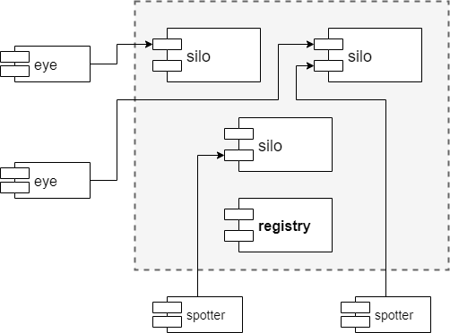

Sauron: segunda parte
=====================

O projeto de Sistemas Distribuídos (SD) corresponde ao desenvolvimento do sistema **Sauron**, que permite ajudar a encontrar pessoas e objetos perdidos.

Na primeira parte do projeto foi construída uma primeira versão do sistema, com um servidor *silo* e dois clientes: *eye* e *spotter*.

Este documento apresenta os requisitos para a segunda parte do projeto, onde o sistema vai ser re-arquitetado para permitir vários servidores e oferecer *tolerância a faltas* no acesso aos dados.

1 Servidor replicado
--------------------

Nesta segunda parte, em vez de existir um único servidor *silo*, devem existir várias *réplicas* com uma cópia integral de todos os dados.
A figura seguinte mostra uma visão global dos componentes da solução.

Os servidores registam-se no servidor de nomes (*registry*).
Os clientes consultam o *registry* para localizar um servidor para os atender e depois enviam pedidos de atualização ou de consulta.

1.1 Registo de serviços
-----------------------

Cabe a cada réplica do servidor, quando lançada, registar-se a si própria no servidor de nomes, indicando o seu endereço. 
Todos os servidores devem ser localizados dinamicamente pelos respetivos clientes, por intermédio de um servidor de nomes bem conhecido. 

Os nomes a usar para os serviços são: `/grpc/sauron/silo/1`, `/grpc/sauron/silo/2`, e assim sucessivamente.

O servidor de nomes a usar é o [ZooKeeper](https://zookeeper.apache.org/) à escuta no porto por omissão.
Para simplificar o código de acesso ao servidor, deve ser usada a biblioteca [ZKNaming](https://github.com/tecnico-distsys/naming).

1.2 Atualização dos argumentos de linha de comando
--------------------------------------------------

O programa do servidor *silo* deve passar a receber a localização do servidor de nomes (`zkhost` e `zkport`), o seu número de réplica `i`, e só depois o seu `host` e `port`.  
Sugere-se que a réplica 1 ocupe o porto 8081, a réplica 2 o porto 8082 e assim sucessivamente.

Os clientes *eye* e *spotter* devem **deixar de receber** o `host` e o `port` do *silo* e passar a receber o `zkhost` e `zkport`.
Como último argumento, opcional, pode ser indicado `i`, o  número de réplica a contactar.  
Quando o número de réplica é indicado, o cliente deve contactar o servidor de nomes para localizar essa réplica em particular.
Quando o argumento não é fornecido, o cliente deve contactar o servidor de nomes e escolher uma das réplicas encontradas, de forma aleatória.

2 Protocolo de replicação
-------------------------

Na segunda parte vai-se replicar o servidor *silo* para permitir tolerância a faltas no armazenamento de observações e nas pesquisas.
Vai-se implementar uma variante do protocolo *gossip architecture* com coerência fraca (cf. aulas teóricas e secção 18.4.1 do livro Coulouris).
Neste protocolo, o cliente apenas precisa de contactar uma réplica para fazer uma atualização.

As opções de implementação devem ser discutidas com os docentes nas aulas de apoio e descritas no relatório de projeto.

2.1 Modelo de interação e faltas
--------------------------------

Como modelos de interação e faltas, deve assumir-se que:

- O sistema é assíncrono e a comunicação pode omitir mensagens (apesar do projeto usar HTTP como transporte, deve assumir-se que outros protocolos de menor fiabilidade podem ser usados);

- Os gestores de réplica podem falhar silenciosamente mas não arbitrariamente, i.e., não há falhas bizantinas;

- Embora o conjunto de gestores de réplica seja estático, os seus endereços não são conhecidos _a priori_ e podem variar ao longo do tempo;
<!-- o servidor de nomes deve ser aproveitado para ultrapassar este desafio; -->

- Existe sempre, pelo menos, uma réplica ativa para atender os clientes;

- As falhas das réplicas são transientes e não definitivas.

2.2 Atualização de réplicas entre si
------------------------------------

As réplicas podem ter vistas divergentes sobre as observações de pessoas e carros.
Para reduzir a divergência, as modificações são propagadas entre réplicas com mensagens de *gossip*.

O processo de atualização de réplicas deve usar uma estrutura de dados, o ***timestamp* vetorial**, para representar uma versão resultante da execução cumulativa de um conjunto de atualizações.
Esta estrutura permite também descobrir diferenças entre réplicas, o que permite enviar/pedir apenas as atualizações que ainda não são conhecidas.

Cada réplica deve ter um temporizador para executar o *gossip* periodicamente.
A periodicidade deverá ser configurável, com o valor por omissão de 30 segundos.

2.3 Leituras coerentes por cliente
----------------------------------

O protocolo *gossip* não pretende garantir a coerência de leituras nos clientes.
No entanto, é possível, com uma ligeira alteração ao protocolo, garantir coerência de leituras na perspetiva de cada cliente.

O caso que deve ser evitado é o seguinte:

- Um cliente `C1` faz uma leitura a partir da réplica `R1` e o valor lido reflete uma atualização `u1`. 
Por outras palavras, o cliente "vê" a atualização `u1`;

- Posteriormente, o mesmo cliente `C1` lê, de uma outra réplica `R2`, e o valor lido não reflete a atualização `u1`. 
Por outras palavras, a atualização `u1` "desapareceu";

A resolução desta anomalia necessitará de modificações no *front-end* do lado do cliente.
Especificamente, pretende-se oferecer a seguinte **garantia**: caso a resposta enviada por uma réplica seja anterior à vista anteriormente no cliente, seja retornada ao cliente esta última.
Assim, ao descartar uma resposta desatualizada (do ponto de vista do cliente), garante-se a coerência de leituras no cliente.

2.4 Atualizações imediatas
--------------------------

Deverá ser criado um **modo alerta** em que as observações que satisfaçam um certo padrão, por exemplo `car 70*` ou `person *1`, passam a ser propagadas imediatamente para todas as réplicas conhecidas, sem esperar pelo próximo *gossip*.

O cliente *spotter* deverá ter um novo comando, `alert`, que permite ativar o modo e que recebe o padrão da pessoa ou carro.  
Por simplificação, pode-se assumir que este modo apenas funciona para um padrão de cada vez.

A implementação deste modo tem de ser tolerante a faltas, de acordo com o modelo descrito em 2.1.

3 Resumo
--------

Em resumo, na segunda parte do trabalho, é necessário criar várias réplicas do *silo*, em que cada uma pode responder autonomamente a clientes, em que existe partilha periódica de atualizações entre réplicas (*gossip*), em que são evitadas leituras incoerentes por um mesmo cliente, e em que é possível ativar um modo de atualização imediata.

4 Avaliação 
-----------

4.1 Entrega
-----------

A segunda entrega do projeto será feita através do repositório GitHub do grupo, antes da hora limite de entrega. 
O grupo deve marcar o código a entregar com uma [*tag*](https://git-scm.com/book/en/v2/Git-Basics-Tagging) específica: `SD_P2`.

4.2 Valorização
---------------

A segunda parte vale 10 valores em 20, distribuídos da seguinte forma:

- Correção de erros da primeira parte e ajustes de acordo com versão atualizada do enunciado (1,5 valores)

- Replicação do *silo* em múltiplos servidores (1 valor)

- Atualização (*gossip*) entre réplicas (2 valores)

- Leituras coerentes pelo mesmo cliente (1,5 valores)

- Modo de atualização imediata (1,5 valores)

- Relatório e demonstração (1,5 valores)

- Qualidade do código -- os mesmos aspetos da primeira parte -- em todos os componentes (1 valor)

A data limite de entrega é: **sábado, 2 de maio de 2020, 17:00**.

4.3 Relatório
-------------

Na segunda parte, além do código-fonte, deve também ser elaborado e entregue um relatório em formato [*MarkDown*](https://guides.github.com/features/mastering-markdown/).

O documento tem que chamar-se `report/README.MD` e as imagens e restantes recursos devem ser colocados na pasta `report/`.

Conteúdos obrigatórios:

- Identificador do grupo em formato *CXX*, fotos, números e nomes dos membros do grupo (ordenados por número de estudante crescente, da esquerda para a direita)

- Definição do modelo de faltas (que faltas são toleradas, que faltas não são toleradas);

- Figura da solução de tolerância a faltas;

- Breve explicação da solução, suportada pela figura anterior;

- Explicação do protocolo em detalhe (descrição das trocas de mensagens);

- Descrição de opções de implementação, incluindo otimizações e melhorias introduzidas.

O relatório deve ter entre 1000 e 1500 palavras.
<!-- 2-3 páginas, assumindo 500 palavras por página A4 -->

4.4 Demonstração
----------------

As instruções de instalação e configuração de todo o sistema, elaboradas na primeira parte, devem ser atualizadas no documento `demo/README.md`.

Deve ser criada uma **nova secção** dedicada às funcionalidades da **segunda parte**.
A duração total da demonstração da segunda parte deverá ser inferior a *5* minutos.
A demonstração do trabalho será realizada ao vivo antes da discussão.

4.5 Discussão
-------------

Todos os estudantes têm que ser avaliados individualmente na discussão final do projeto. 
As notas das várias partes são indicativas e sujeitas a confirmação na discussão final, na qual todo o trabalho desenvolvido durante o semestre será tido em conta.
É muito importante que a divisão de tarefas ao longo do trabalho seja equilibrada pelos membros do grupo.

Todas as discussões e revisões de nota do trabalho devem contar com a presença obrigatória de todos os membros do grupo, quer se realizem ao vivo, quer se realizem por teleconferência com vídeo.

4.6 Atualizações
----------------

Para acompanhar as novidades sobre o projeto, consultar regularmente a [página Web dos laboratórios](http://disciplinas.tecnico.ulisboa.pt/leic-sod/2019-2020/labs/).  
Caso venham a surgir correções ou clarificações neste documento, podem ser consultadas no histórico (_History_).

**Bom trabalho!**
